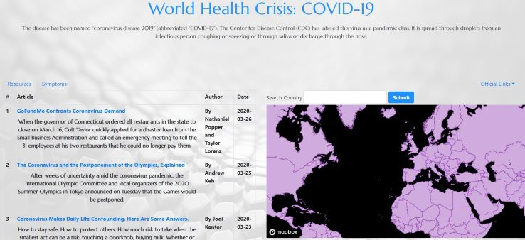

# Project-1 (COVID-19)

https://vu-coding-bootcamp-group1.github.io/project-1/

## Objective:

To create an app as a team relevant to interests of the group.

## Rationale:

Because people all across the world are worried about the coronavirus, our team decided to develop a web application that puts relevant information about the virus together in one place. The user will be able to search statistics by country and find online news articles that are relevant to COVID-19.

## What We Used:

1. APIs:
   - New York Times
   - https://corona.lmao.ninja/countries (COVID-19 by country)
   - GEO JSON API
2. HTML
3. CSS
4. Bootstrap
5. JavaScript
6. jQuery
7. AJAX
8. CDNs
9. Firebase

## Technical Aspects:

1. Description of Problem:
    - To make a working web application housing various information on COVID-19
2. How it was solved:
    - After countless hours of research, reviews of previous activities, study groups, tutor support, and TA support, we arrived at a working web application dealing with the pandemic of COVID-19.
3. Our approach:
   - We divided up front-end and back-end work.
   - We used user stories to stay on track for what we wanted accomplished.
   - We helped each other when one of us would hit a snag in our code or needed additional assistance completing it.

## Team Members:

1. Zach Sievers
2. Vance Newberry
3. Darrick Fisher
4. Amy Haerr
